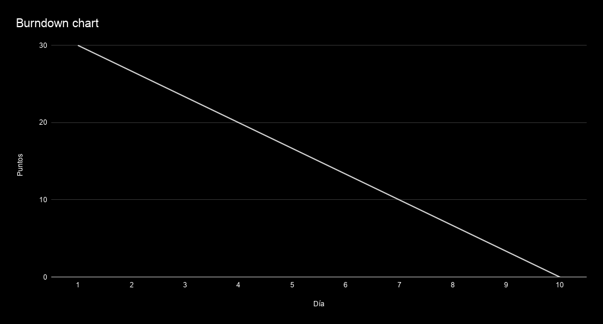
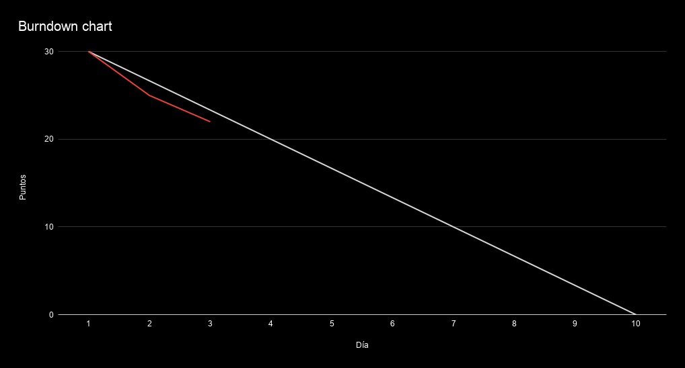
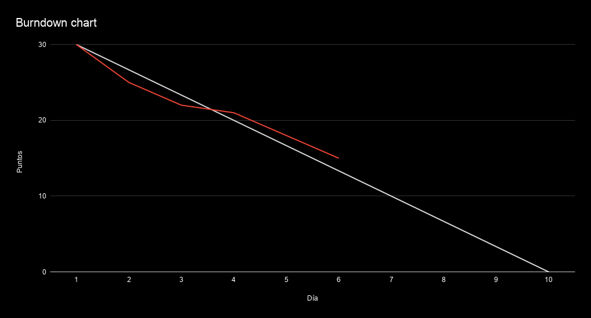
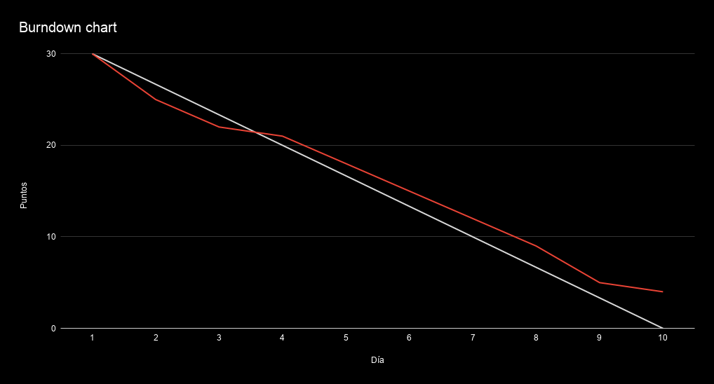
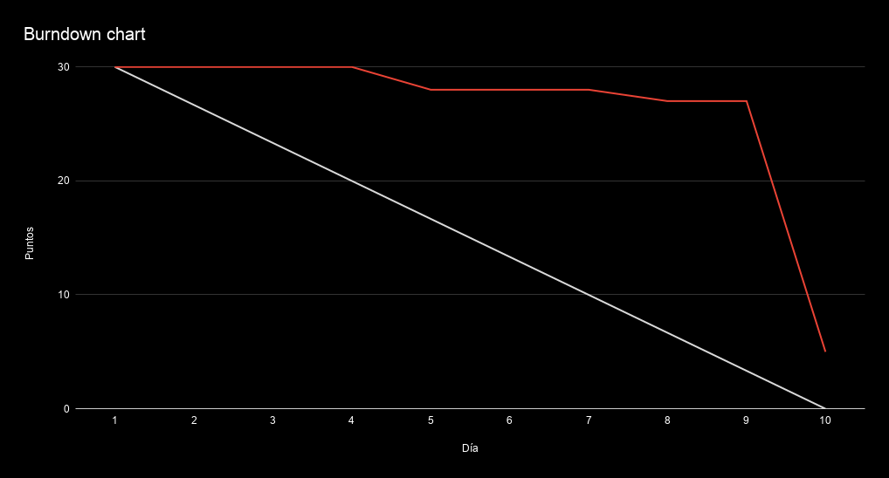
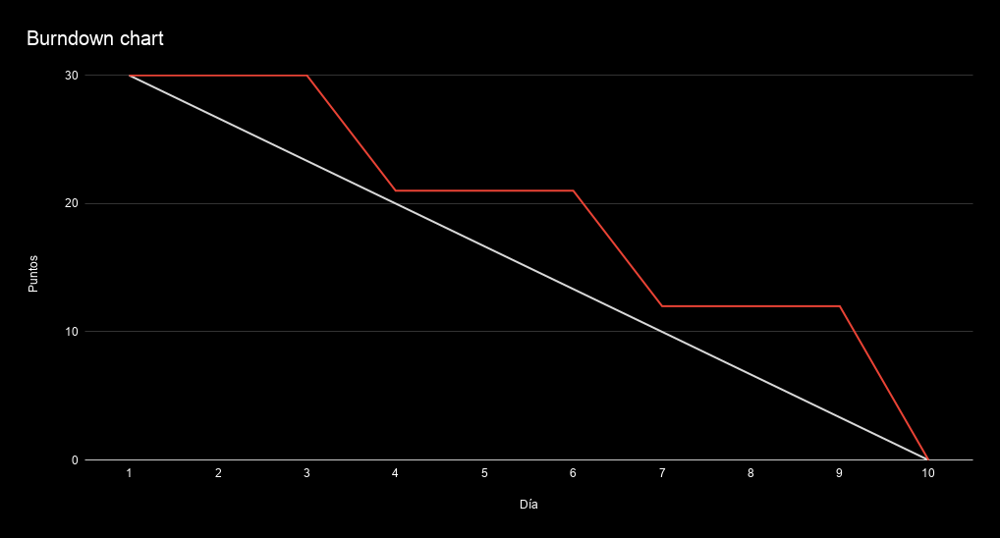

## Información gráfica

Existen varias herramientas, reportes, y otras formas de desplegar información de forma tal que, en un vistazo rápido, podamos sacar conclusiones (o al menos detectar alguna anomalía que nos incentive a tomar alguna decisión).

## Scrum board
El Scrum board, o tablero Scrum, es una instantánea del estado de un Sprint. Consiste en una tabla con (al menos) 3 columnas (de izquierda a derecha):
- To do: Tareas por hacer.
- En progreso: Tareas que están siendo desarrolladas.
- Finalizadas: Tareas que ya fueron realizadas

(simple, no?)

En un tablero físico, al comienzo de un Sprint (durante la Sprint planning), el equipo anota los ítems del Sprint backlog en notas (post-its) y los coloca en la primera columna. Se recomienda que se coloquen en la parte superior las tareas más prioritarias. Cuando une miembre del equipo va a comenzar una tarea, mueve el post-it a la columna del centro para indicar que se encuentra en progreso. Esto evita que haya más de una persona trabajando en la misma tarea (por accidente). Al finalizar, mueve el post-it a la última columna.

Si bien es una práctica sencilla, el resultado trae muchos beneficios. Uno de ellos, es poder identificar gráficamente, si en un momento dado, el equipo está en dificultades.

### Ejemplos:

#### Diagonal ascendente
El board de la siguiente imagen es aceptable **solamente** en el minuto cero del Sprint.  

En cualquier otro momento, este board indica que no se ha iniciado trabajo alguno (o que el equipo no está manteniéndolo actualizado, lo cual debería ser una alerta para le Scrum master)

#### Forma de "U"
En cambio, el siguiente, presenta un problema más complejo e interesante

La forma de "U" indica que hay pocas tareas pendientes, pocas completadas y muchas en desarrollo. Es una tendencia (casi una trampa) pensar que somos productives si logramos trabajar en muchos ítems al mismo tiempo. Por el contrario, está demostrado(?) que el cambio de contexto y la desconcentración que esto genera, reducen el rendimiento.
También podría pasar que muchas de esas tareas se hayan comenzado pero se hayan pausado en algún punto por alguna dependencia externa. Al no haber una columna "on hold", esas tareas quedan falsamente "en progreso". Si bien es correcto saltar a otra tarea si nos bloqueamos, es importante tomar esto como una métrica. Si esto ocurre frecuentemente, puede indicar que hay alguna falla en la planificación del Sprint. Este es uno de los ejemplos que respaldan el concepto de que "Scrum no resuelve temas, pero los expone". Si seleccionamos las herramientas adecuadas, contaremos con buena información para indagar y tomar decisiones.

## Burndown chart

El burndown chart es un gráfico de coordenadas en donde se compara el progreso real con el progreso estimado. Su lógica es bastante simple, aunque al principio no lo parezca.

Una vez planificado el Sprint, tendremos una cantidad de puntos por *quemar*. Para este ejemplo, supongamos que la velocidad del equipo es de 30 puntos (y por lo tanto, el equipo comprometió funcionalidades por 30 puntos). Una curva ideal describiría una quema lineal, como la que se muestra en el siguiente ejemplo:

El primer día, quedan 30 puntos por quemar. El segundo, algo menos (26.66...) y así, respondiendo a una recta que debería llegar a 0 puntos pendientes el último día del sprint.

Pero como sabemos, el equipo comenzará a trabajar y la evolución podría variar respecto del ideal. Por ejemplo, la siguiente imagen muestra el resultado de los primeros 2 días de trabajo.

Como se puede ver, al fin del segundo día de trabajo, quedan 22 puntos por quemar (en lugar de 23.33...). En otras palabras, el equipo quemó 8 puntos en lugar de 6.66.... Lo que significa que el equipo está siendo más eficiente que lo estimado.

Si volvemos a darle play, la siguiente imagen nos muestra el resultado al cabo de 5 días.

La tendencia parece haberse revertido, y ahora el equipo está retrasado.

Es decir que, gráficamente, podemos identificar si estamos adelantados, retrasados o en tiempo, simplemente viendo si nuestra línea de burndown se encuentra por encima o por debajo de la quema ideal. Más aún, podemos identificar si las diferencias son significativas y/o generan alguna tendencia. **Siempre y cuando la línea de burndown "abrace" a la ideal, el equipo se encuentra trabajando como se espera**.

Si avanzamos hacia el final, podemos ver el resultado

La demora detectada al cabo de 5 días, no se revirtió. De hecho, durante el último día, parece haber aumentado.

Es normal que haya desvíos respecto del plan. Como se menciona varias veces en este repo, la idea es que SCRUM permita inspeccionar y adaptar los planes. Más aún, las iteraciones y sus revisiones nos permiten mejorar la forma en que trabajamos. Si comparamos sucesivos burndown charts de un buen equipo Scrum, deberían verse cada vez más cerca del ideal.

### Problemas comunes

Algunas gráficas ya representan anti-patrones. Es decir, formas que coinciden con conductas conocidas a mejorar.

#### Poca atención al proceso

Esta gráfica puede indicar un escenario poco probable: El equipo es capaz de realizar todo el trabajo en solo 1 o 2 días. De todas formas, si este fuera el caso, el equipo está rindiendo menos de lo que podría rendir.

Cuando vemos esta forma, lo más probable es que el equipo no esté manteniendo actualizado el estado de sus tareas. En algún momento del Sprint, por lo general hacia el final, alguien detecta el problema y pide que todos actualicen el estado. Esta conducta va en contra de la transparencia y la adaptación. Es imposible entender el avance, identificar desvíos y proponer cambios para lograr los objetivos. **Es responsabilidad del equipo mantener el estado actualizado, y es responsabilidad de le Scrum Master que esto ocurra**. La forma recomendada es *entrenando* al equipo. Cuando esto no se hace, le Scrum Master debe estar constantemente *persiguiendo* al equipo.

#### Poca granularidad de tareas

Esta gráfica se presenta frecuentemente cuando las tareas son poco granulares. Cada tarea requiere varios días para poder ser completada y por lo tanto, vemos "escalones" en la gráfica. Si bien, a priori, esto no parece ser un problema, en un Sprint de 10 días, tener 3 días de poca transparencia es demasiado. No detectar los desvíos en este tiempo puede impactar el desarrollo del Sprint evitando que tomemos las decisiones necesarias.
