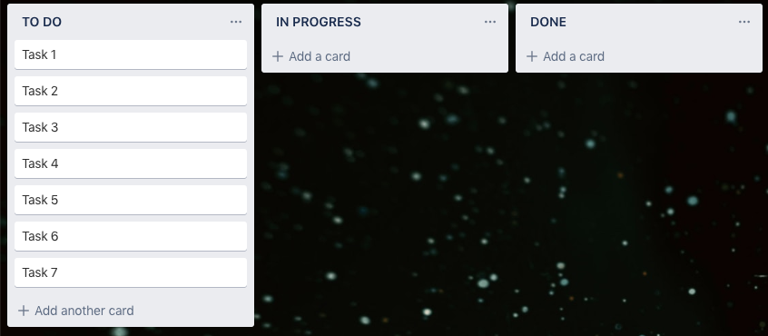
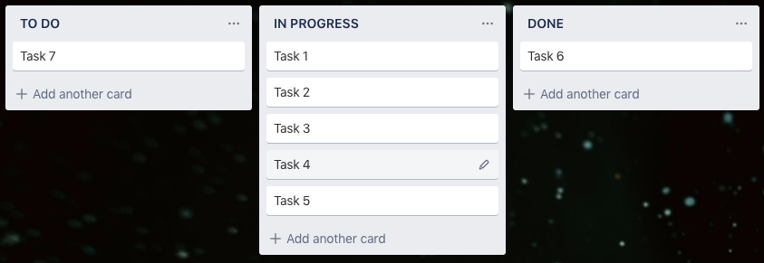

## Información gráfica

Existen varias herramientas, reportes, y otras formas de desplegar información de forma tal que, en un vistazo rápido, podamos sacar conclusiones (o al menos detectar alguna anomalía que nos incentive a tomar alguna decisión).

## Scrum board
El Scrum board, o tablero Scrum, es una instantánea del estado de un Sprint. Consiste en una tabla con (al menos) 3 columnas (de izquierda a derecha):
- To do: Tareas por hacer.
- En progreso: Tareas que están siendo desarrolladas.
- Finalizadas: Tareas que ya fueron realizadas

(simple, no?)

En un tablero físico, al comienzo de un Sprint (durante la Sprint planning), el equipo anota los ítems del Sprint backlog en notas (post-its) y los coloca en la primera columna. Se recomienda que se coloquen en la parte superior las tareas más prioritarias. Cuando une miembre del equipo va a comenzar una tarea, mueve el post-it a la columna del centro para indicar que se encuentra en progreso. Esto evita que haya más de una persona trabajando en la misma tarea (por accidente). Al finalizar, mueve el post-it a la última columna.

Si bien es una práctica sencilla, el resultado trae muchos beneficios. Uno de ellos, es poder identificar gráficamente, si en un momento dado, el equipo está en dificultades.

### Ejemplos:

#### Diagonal ascendente
El board de la siguiente imagen es aceptable **solamente** en el minuto cero del Sprint.  

En cualquier otro momento, este board indica que no se ha iniciado trabajo alguno (o que el equipo no está manteniéndolo actualizado, lo cual debería ser una alerta para le Scrum master)

#### Forma de "U"
En cambio, el siguiente, presenta un problema más complejo e interesante

La forma de "U" indica que hay pocas tareas pendientes, pocas completadas y muchas en desarrollo. Es una tendencia (casi una trampa) pensar que somos productives si logramos trabajar en muchos ítems al mismo tiempo. Por el contrario, está demostrado(?) que el cambio de contexto y la desconcentración que esto genera, reducen el rendimiento.
También podría pasar que muchas de esas tareas se hayan comenzado pero se hayan pausado en algún punto por alguna dependencia externa. Al no haber una columna "on hold", esas tareas quedan falsamente "en progreso". Si bien es correcto saltar a otra tarea si nos bloqueamos, es importante tomar esto como una métrica. Si esto ocurre frecuentemente, puede indicar que hay alguna falla en la planificación del Sprint. Este es uno de los ejemplos que respaldan el concepto de que "Scrum no resuelve temas, pero los expone". Si seleccionamos las herramientas adecuadas, contaremos con buena información para indagar y tomar decisiones.
